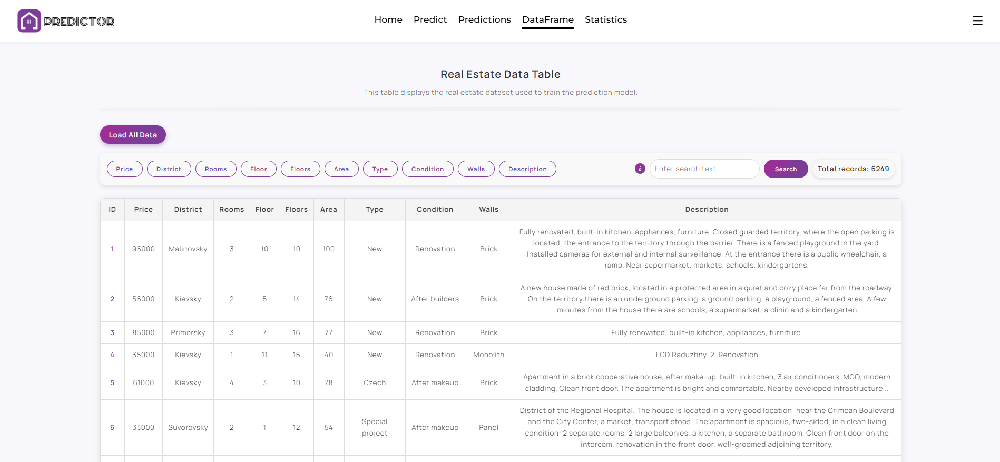

# REAL ESTATE PRICE PREDICTION SYSTEM

PricePredictor is a web application for predicting real estate prices based on user-provided parameters using machine learning technologies. The project features a user-friendly interface, authorization support, data analysis, and visual presentation of predictions.

---

## Overview

**PricePredictor** is an information system that allows users to receive price predictions for real estate properties based on features such as: area, district, floor level, building type, condition, wall materials, and more.

The app provides:
- A full-featured web interface for user interaction
- An authorization/registration system
- Statistics and analytics
- Prediction history tracking
- A flexible architecture for future scaling

---

## Core Features

### Authentication and Authorization
- User registration  
- User login  
- Login credential validation  
- Logout functionality  
- Page access restriction for unauthenticated users  
- Auto-login support  

### Real Estate Price Prediction
- Input form for property parameters  
- Display of predicted price in a user-friendly format  
- Saving prediction results to the database  
- Viewing all predictions made by the user  

### Analytics and Statistics
- Summary statistics page based on the DataFrame  
- Visual graphs and numeric analysis  
- User-specific prediction history graphs  

### Machine Learning
- Regression model usage (e.g., linear regression)  
- Preprocessing and scaling input data  
- Model loading, training, and prediction  
- Ability to update or replace the model  

### Database Management
- User database  
- Predictions database  
- Real estate property database  
- Separate logic for managing database connections  

### Administrative and Utility Functions
- Error, request, and event logging  
- User-friendly error pages (`error.html`)  
- Utilities for data conversion, validation, and processing  
- Functionality testing using `pytest`  

---

## Technologies

- **Backend:** Python 3, Flask  
- **Machine Learning:** scikit-learn, pandas, numpy  
- **Databases:** SQLite  
- **Validation:** Pydantic  
- **Frontend:** HTML5, CSS3, JavaScript  
- **Testing:** Pytest  
- **Logging:** Request, error, and event logging  

Next, I will demonstrate the detailed structure of the project and showcase  
screenshots of the web application.

---

## List of Available Website Pages

### 1. Home Page
This page introduces users to the purpose and functionality of the project.  
It explains how the system assists in predicting real estate prices.


<p align="center"><small><small><em>Image: Homepage interface</em></small></small></p>

---

### 2. Predict Page
Core feature of the system. Users enter property parameters into a clean, interactive form, and receive a predicted price.


<p align="center"><small><small><em>Image: Prediction input and result section</em></small></small></p>

---

### 3. Predictions Page
Displays all prediction requests made by users.  
Includes filtering by price or ID for both personal and public results.


<p align="center"><small><small><em>Image: Prediction input and result section</em></small></small></p>

---

### 4. DataFrame Page
Shows the dataset used for model training in a searchable table.  
Supports:
- **Simple Search** (text/numbers with automatic filtering)
- **Advanced Search** using format `field:value` (e.g. `type:new`)


<p align="center"><small><small><em>Image: Dataset table with filtering and search</em></small></small></p>

---

### 5. Statistics Page
Provides analytical charts and histograms.  
Based on real estate data from Odesa, 2020.


<p align="center"><small><small><em>Image: Real estate analytics and graphs</em></small></small></p>

---

### 6. Authorization Page
Login and registration with "Remember Me" token + secure long-term cookie.  
Supports auto-login for returning users.


<p align="center"><small><small><em>Image: Login and registration</em></small></small></p>

---

### 7. Profile Page
Displays user prediction history in collapsible view.  
Includes:
- Activity chart  
- Detailed view of each prediction  
- Option to delete predictions  
- Editable account info


<p align="center"><small><small><em>Image: User profile with prediction history </em></small></small></p>

---

## Architecture of the System

### Project Architecture Overview

PricePredictor is built with a modular architecture using Flask.  
Key components include:

- `app/` — main Flask app with routes and configs  
- `auth/` — user registration, login, token management  
- `ml/` — ML model (HistGradientBoostingRegressor), training scripts, scalers  
- `models/` — SQLAlchemy models (users, predictions, real estate)  
- `schemas/`, `utils/` — Pydantic validation and general utilities  
- `templates/` and `static/` — frontend logic  
- `logs/`, `tests/` — system logs and automated tests  
- 3 SQLite databases: `users.db`, `real_estate.db`, `predictions.db`  
- `run.py` — entry point to launch the web app  

```bash
PricePredictor/
│
├── app/                            # Main application directory
│   ├── __init__.py                 # Initializes the Flask app
│   ├── config.py                   # Application configuration
│   ├── routes.py                   # Global routes
│
│   ├── controllers/                # API-level controllers
│   │   ├── __init__.py
│   │   └── real_estate_controller.py  # Handles real estate-related API logic
│
│   ├── database/                   # Database configuration and connection logic
│   │   ├── __init__.py
│   │   ├── database.py             # Database initialization
│   │   └── dbconnection.py         # Database connection utilities
│
│   ├── auth/                       # User authentication and login logic
│   │   ├── __init__.py
│   │   ├── routes.py               # Auth-related routes (login/register)
│   │   ├── models/                 # User models
│   │   │   ├── __init__.py
│   │   │   └── models.py
│   │   ├── services/               # Business logic for user interaction
│   │   │   ├── __init__.py
│   │   │   └── services.py
│   │   ├── src/
│   │   │   ├── login_form/         # Login form logic
│   │   │   │   ├── __init__.py
│   │   │   │   └── login_form.py
│   │   │   ├── user_login/         # Credential verification logic
│   │   │   │   ├── __init__.py
│   │   │   │   └── user_login.py
│   │   │   └── utils/              # Auth-related utility functions
│   │   │       ├── __init__.py
│   │   │       └── utils.py
│   │   └── templates/              # HTML templates for login/register
│   │       ├── login.html
│   │       └── register.html
│
│   ├── ml/                         # Machine Learning models and services
│   │   ├── __init__.py
│   │   ├── train_model.py          # Script to train the ML model
│   │   ├── ml_service.py           # Prediction logic for serving the model
│   │   ├── price_model.pkl         # Trained model (pickle format)
│   │   ├── scaller.pkl             # Saved StandardScaler instance
│   │   ├── feature_names.pkl       # Feature names used in the model
│   │   ├── target_encoder.pkl      # Encoder for categorical features
│   │   └── metrics_results.json    # Stored prediction quality metrics
│
│   ├── models/                     # SQLAlchemy database models
│   │   ├── __init__.py
│   │   ├── predicts/               # Models for saving prediction results
│   │   │   ├── __init__.py
│   │   │   └── models.py
│   │   ├── real_estate/            # Models for real estate data
│   │   │   ├── __init__.py
│   │   │   └── models.py
│   │   └── users/                  # User account models
│   │       ├── __init__.py
│   │       └── model.py
│
│   ├── schemas/                    # Pydantic schemas for request/response validation
│   │   ├── __init__.py
│   │   └── pydantic_schemas/
│   │       ├── __init__.py
│   │       └── post.py             # Request/response schema definitions
│
│   ├── static/                     # Static assets (CSS, JS, images)
│   │   ├── css/                    # Stylesheets
│   │   ├── images/                 # Image assets
│   │   ├── js/                     # JavaScript files
│   │   └── json_animations/        # UI animations in JSON format
│
│   ├── templates/                  # Main HTML templates
│   │   ├── dataframe.html          # Data table view
│   │   ├── error.html              # Error page template
│   │   ├── index.html              # Base template
│   │   ├── main.html               # Homepage
│   │   ├── predict.html            # Prediction input form
│   │   ├── predictions.html        # Prediction history view
│   │   ├── profile.html            # User profile page
│   │   └── statistics.html         # Data statistics page
│
│   ├── use_cases/                  # Business logic and data processing for ML
│   │   ├── __init__.py
│   │   └── data_processing_use_case.py
│
│   ├── utils/                      # General-purpose utility functions
│   │   ├── __init__.py
│   │   └── utils.py
│
│   ├── predictions.db              # Database for stored predictions
│   ├── real_estate.db              # Real estate listings database
│   └── users.db                    # User account database
│
├── logs/                           # Logging system
│   └── logs/
│       ├── combined.log            # Combined application logs
│       ├── error.log               # Error logs
│       └── request.log             # HTTP request logs
│   ├── __init__.py
│   └── logclass.py                 # Logging classes and configuration
│
├── tests/                          # Unit and integration tests
│   └── responsclass/
│       ├── __init__.py
│       └── responsclass.py         # API response validation
│   ├── __init__.py
│   ├── config.py                   # Test configuration
│   ├── conftest.py                 # Pytest fixtures
│   ├── test_dataframe.py           # DataFrame page tests
│   └── test_predictions.py         # Prediction logic tests
│
├── .env
├── .gitignore
├── requirements.txt               # Project dependencies
├── README.md                      # Project documentation
└── run.py                         # Entry point for running the application
```

---

## Sequence Diagram

This diagram illustrates how a prediction request flows through the system.

**Main components:**
- User
- User Interface
- Route Controller
- ML Model
- Database

**Flow:**
1. User submits a prediction request via the UI  
2. The controller validates input and forwards to ML module  
3. Prediction is generated and returned  
4. Result is saved to DB and displayed in UI  
5. Request history is fetched asynchronously for smooth UX


<p align="center"><small><small><em>Image of a UML sequence diagram </em></small></small></p>

---

## Profile Functionality

### Account Settings:
- Change name (with validation)
- Change password (check old, validate new)
- Change email (via confirmation code + password check)

Each setting follows a secure and clear two-step process.


<p align="center"><small><small><em>Image of the profile function list</em></small></small></p>

---

## Interactive Animations

The video below showcases animated UI elements:
- Logo animation  
- Prediction loading screen  
- Login animation  
- Auto-login animation (token-based)  
[Video file](https://github.com/DENIS-ILKOVICH/price-predictor/tree/main/.assets/videos)

---


## How to Run the Project

1. **Create and activate a virtual environment:**

    ```bash
    python -m venv venv
    source venv/bin/activate      # for Linux/macOS
    venv\Scripts\activate         # for Windows
    ```

2. **Install dependencies:**

    ```bash
    pip install -r requirements.txt
    ```

3. **Run the application:**

    ```bash
    python run.py
    ```

4. **Open in your browser:**

    ```
    http://127.0.0.1:5000
    ```

---

## Author

**Denys Ilkovych**  
Developer and initiator of the **PricePredictor** project.

